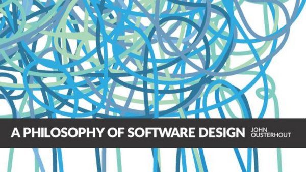

> Last updated on *June 2021*

# Clean Code
{:width="400px"}
{: style="text-align: center;"}

Robert C. Martin's classic for developers of any experience and background. ~~I believe that any developer that is serious about their profession should have a copy of this book.~~

There is a plethora of information compiled into an easy-to-read package that will help you establish a solid foundation for practicing the best principles and practices of software development.

__June 2021 Update__ - It has been over two years since I've read this book cover to cover.
Although this book has provided me insight that more or less helped established the foundation of my software engineering skills, it has dawned upon me that this book is extremely dated now, perhaps given the fact that it first came out in 2008. 
A lot has changed since this book came out and I feel that some of the ideas proposed are things that I would not preach nor practice between my last full read and now. Although I feel there is still good bits of advice and examples, it's been getting more difficult for me to recommend soley just this book. Nowadays, I recommend pairing it with [A Philosophy of Software Design](#a-philosophy-of-software-design) which gives a good combo.

# A Philosophy of Software Design
{:width="400px"}
{: style="text-align: center;"}

A more recently published work that's heavily focused on the ideas and thought process of designing software. Although the ideas brought forth in this book are at a much higher level with not as many examples, there are some parallels that can be drawn between this and some of the hard and fast rules that are presented in *Clean Code*.

My impression is that this isn't the most beginnier friendly book. However, it is a solid pickup once you've been writing production code for a bit and have recalled situations where you've racked your brain over how to make a change with the most minimal effort. The insights here will arm you with a set of principles/ideas in mind when thinking about how to approach writing software.

# Working Effectively with Legacy Code
{:width="400px"}
{: style="text-align: center;"}

Once you've had a bit of experience working with existing code bases, this is another book to have. There are challenges that are often presented in existing legacy code (and quite frankly they are the ones that make our jobs difficult and you will run into them quite often in industry). Knowing how to handle legacy code is a skill that is essential and this book will expose you to all practical advice that you can leverage to hone that skill.

# The Mythical Man-Month
{:width="400px"}
{: style="text-align: center;"}

A timeless classic in the field of software engineering. Read this if you're interested in becoming a well-rounded developer that wants to understand the people-element of software projects.

Having this knowledge will help you understand elements from the management perspective which is invaluable as you progress on with your career in industry.
